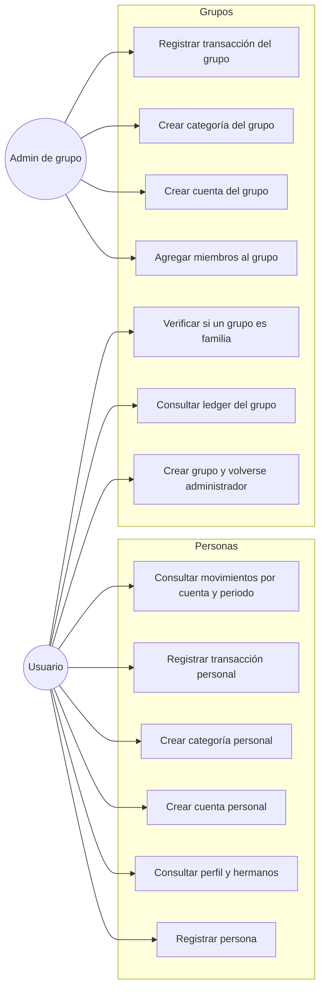
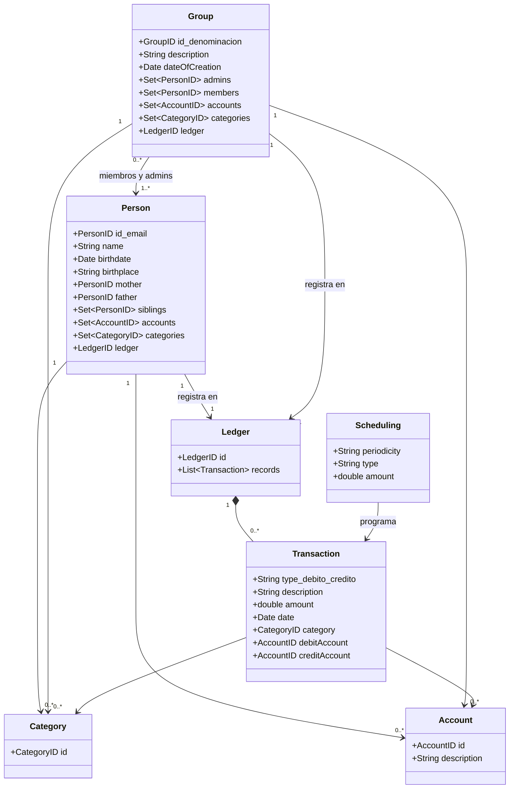
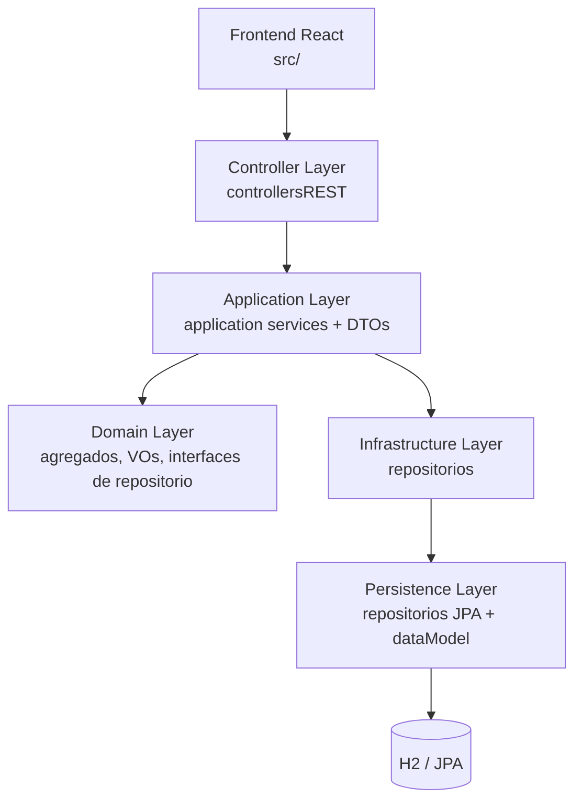
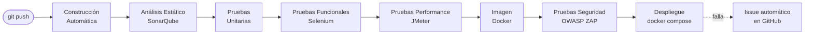
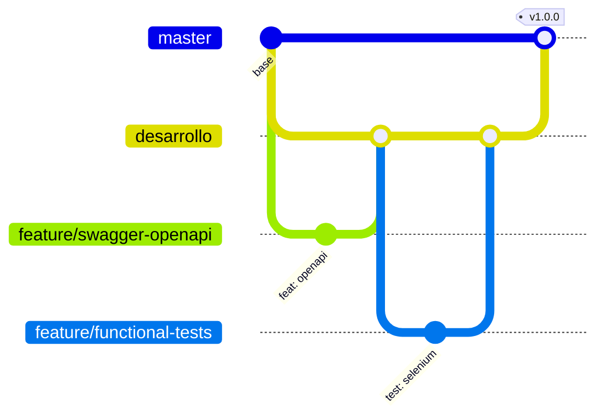

# Personal Finance Management — Proyecto Final IS-2

> **Curso:** Ingeniería de Software II — UCSP 2026
> **Docente:** Edgar Sarmiento Calisaya

Aplicación web para la gestión de finanzas personales y grupales, evolucionada mediante un
**pipeline de integración y despliegue continuo (CI/CD)** con Jenkins, aplicando **DDD**,
principios **SOLID**, **TDD** y un flujo de trabajo **GitFlow + Kanban**.

---

## Índice

1. [Equipo de trabajo](#1-equipo-de-trabajo)
2. [Propósito del proyecto](#2-propósito-del-proyecto)
3. [Funcionalidades — Casos de uso](#3-funcionalidades--casos-de-uso)
4. [Modelo de dominio — Clases y módulos](#4-modelo-de-dominio--clases-y-módulos)
5. [Visión general de arquitectura — DDD](#5-visión-general-de-arquitectura--ddd)
6. [Módulos y servicios REST (OpenAPI / Swagger)](#6-módulos-y-servicios-rest-openapi--swagger)
7. [Pipeline CI/CD — Etapas y tareas](#7-pipeline-cicd--etapas-y-tareas)
8. [Cómo ejecutar el proyecto](#8-cómo-ejecutar-el-proyecto)
9. [Gestión de tareas — GitHub Project](#9-gestión-de-tareas--github-project)
10. [Estrategia de branching y releases](#10-estrategia-de-branching-y-releases)
11. [Tecnologías utilizadas](#11-tecnologías-utilizadas)

---

## 1. Equipo de trabajo

| Integrante        | GitHub                                            | Responsabilidades principales                                  |
|-------------------|---------------------------------------------------|----------------------------------------------------------------|
| Joel Reinoso      | [@jarbit8](https://github.com/jarbit8)            | Pipeline Jenkins, Docker, SonarQube, integración CI/CD          |
| Jossein Morales   | [@J1UNIM4](https://github.com/J1UNIM4)            | Backend, dominio (agregado Person), mocks de servicios          |
| Karoline Paredes  | [@karo-tiki](https://github.com/karo-tiki)        | QA: pruebas de servicios de aplicación (Group), Selenium        |
| Angélica Barreros | [@angelica1822](https://github.com/angelica1822)  | QA: pruebas de servicios (Category), JMeter, documentación      |

Cada integrante trabaja sobre ramas `feature/*` o `test/*`, con issues asignados en el
tablero Kanban y commits propios en el repositorio (ver [sección 9](#9-gestión-de-tareas--github-project)).

## 2. Propósito del proyecto

**Personal Finance Management** permite registrar y consultar las finanzas de personas y
grupos (por ejemplo, familias):

- Registrar **personas** con sus datos y relaciones familiares (madre, padre, hermanos).
- Crear **grupos** con administradores y miembros, cada uno con su propio libro contable.
- Administrar **cuentas** y **categorías** por persona o por grupo.
- Registrar **transacciones** (débito/crédito) en **ledgers** y consultarlas por cuenta y
  rango de fechas.

El proyecto parte de una base de código DDD existente (ver
[docs/TUTORIAL_DDD.md](docs/TUTORIAL_DDD.md)) y el objetivo del curso fue **evolucionarla**
con: pruebas automatizadas (unitarias, funcionales, performance y seguridad), análisis
estático, documentación OpenAPI, containerización y un **pipeline CI/CD completo en Jenkins**
disparado por cada commit.

## 3. Funcionalidades — Casos de uso



La lista completa de historias de usuario está en [UserStories.txt](UserStories.txt).

## 4. Modelo de dominio — Clases y módulos

El dominio se organiza en **seis agregados** (un repositorio por agregado), con
**Value Objects** compartidos para los identificadores:



**Módulos (bounded contexts):**

| Módulo        | Agregados              | Responsabilidad                                          |
|---------------|------------------------|----------------------------------------------------------|
| **Persons**   | `Person`               | Personas, relaciones familiares, sus cuentas y categorías |
| **Groups**    | `Group`                | Grupos, membresía, administración                         |
| **Ledgers**   | `Ledger`, `Scheduling` | Transacciones y su programación                           |
| **Accounts**  | `Account`              | Cuentas (de personas o grupos)                            |
| **Categories**| `Category`             | Categorías de clasificación de transacciones              |

## 5. Visión general de arquitectura — DDD

El backend sigue una arquitectura **DDD por capas** (el dominio no depende de nada externo):



Estructura de paquetes (`backend/src/main/java/com/finance/project`):

```
├── controllerLayer/controllersREST/      # controladores REST por módulo
│   ├── personControllers/
│   ├── groupControllers/
│   └── otherControllers/
├── applicationLayer/applicationServices/ # servicios de aplicación (casos de uso)
│   ├── personServices/
│   ├── groupServices/
│   └── otherServices/
├── domainLayer/
│   ├── domainEntities/aggregates/        # person, group, ledger, account, category, scheduling
│   ├── domainEntities/vosShared/         # PersonID, GroupID, AccountID, CategoryID, LedgerID...
│   ├── repositoriesInterfaces/           # contratos de persistencia (DIP)
│   └── exceptions/
├── infrastructureLayer/repositories/     # implementaciones de repositorios
├── persistenceLayer/repositoriesJPA/     # spring data JPA
├── dataModel/                            # modelo de datos + assemblers (SRP)
├── dtos/                                 # DTOs + assemblers entre capas
└── config/                               # configuración (OpenAPI)
```

Decisiones de diseño aplicadas:

- **DDD**: agregados con raíz única, value objects inmutables, un repositorio por agregado.
- **SOLID**: las capas superiores dependen de **interfaces** del dominio
  (`repositoriesInterfaces`), no de implementaciones (DIP); servicios de aplicación con una
  única responsabilidad (SRP).
- **DTOs + Assemblers** para comunicar capas sin exponer entidades del dominio.
- **TDD**: el dominio y los servicios cuentan con suites de pruebas JUnit 5 + Mockito
  (182 pruebas unitarias, ver [sección 7.3](#73-pruebas-unitarias--junit-5--mockito)).

## 6. Módulos y servicios REST (OpenAPI / Swagger)

La API está documentada en formato **OpenAPI 3** con **springdoc**. Con la aplicación corriendo:

- Especificación OpenAPI: `http://localhost:8080/v3/api-docs`
- Interfaz Swagger UI: `http://localhost:8080/swagger-ui/index.html`

### Módulo Persons — gestión de personas y sus finanzas

| Método | URL | Parámetros |
|--------|-----|------------|
| POST | `/persons` | body: `email, name, birthdate, birthplace` |
| GET | `/persons/{personEmail}` | path: email |
| GET | `/persons/{personEmail}/accounts` | path: email |
| POST | `/persons/{personEmail}/accounts` | path: email · body: `description, denomination` |
| GET | `/persons/{personEmail}/categories` | path: email |
| POST | `/persons/{personEmail}/categories` | path: email · body: `denomination` |
| GET | `/persons/{personEmail}/siblings` | path: email |
| GET | `/persons/{personEmail}/groups` | path: email |
| GET | `/persons/{id}/siblings/{id_otherPerson}` | path: ambos emails |
| POST | `/persons/{personEmail}/ledgers/records` | path: email · body: transacción |
| PUT | `/persons/{personEmail}/ledgers/records/{transactionNumber}` | path: email, número |
| DELETE | `/persons/{personEmail}/ledgers/records/{transactionNumber}` | path: email, número |
| GET | `/persons/{personID}/ledgers/records` | query: `accountDenomination, startDate, endDate` |

### Módulo Groups — grupos, membresía y finanzas grupales

| Método | URL | Parámetros |
|--------|-----|------------|
| POST | `/groups` | body: `personEmail, groupDenomination, groupDescription` |
| GET | `/groups/{groupDenomination}` | path: denominación |
| GET | `/groups/{groupDenomination}/admins` | path: denominación |
| GET | `/groups/{groupDenomination}/members` | path: denominación |
| GET | `/groups/{groupDenomination}/allMembers` | path: denominación |
| POST | `/groups/{denomination}/members` | path: denominación · body: emails |
| GET | `/groups/{groupDenomination}/ledgers/records` | path: denominación |
| POST | `/persons/{personEmail}/groups/{groupDenomination}/accounts` | body: cuenta |
| GET | `/persons/{personEmail}/groups/{groupDenomination}/accounts` | path |
| POST | `/persons/{personEmail}/groups/{groupDenomination}/categories` | body: categoría |
| GET | `/persons/{personEmail}/groups/{groupDenomination}/categories` | path |
| POST | `/persons/{personEmail}/groups/{groupDenomination}/ledgers/records` | body: transacción |
| PUT | `/persons/{personEmail}/groups/{groupDenomination}/ledgers/records/{transactionNumber}` | path |
| DELETE | `/persons/{personEmail}/groups/{groupDenomination}/ledgers/records/{transactionNumber}` | path |
| GET | `/groups/areFamily` | — |
| GET | `/groups/areFamily/{groupDenomination}` | path: denominación |

**Modelos clave:** `Person`, `Group`, `Ledger` (agregados raíz); `Transaction`, `Account`,
`Category`; VOs `PersonID (email)`, `GroupID (denominación)`, `AccountID`, `CategoryID`, `LedgerID`.

## 7. Pipeline CI/CD — Etapas y tareas

El pipeline está definido como **código** en el [Jenkinsfile](Jenkinsfile) (pipeline
declarativo) y se **dispara automáticamente con cada commit** al repositorio
(webhook de GitHub + polling de respaldo).



### 7.1 Construcción Automática — Maven

- `./mvnw -B -DskipTests clean package`: compilación, **gestión de dependencias** y
  **empaquetado** del jar ejecutable de Spring Boot.
- El **Maven Wrapper** (`mvnw`) garantiza la misma versión de Maven (3.9.16) en
  cualquier agente, sin instalación previa.
- El jar se archiva como artefacto del build (`target/*.jar`).

### 7.2 Análisis Estático — SonarQube

- `./mvnw verify sonar:sonar` dentro de `withSonarQubeEnv`, contra el servidor SonarQube
  del [docker-compose.cicd.yml](docker-compose.cicd.yml) (`http://localhost:9000`).
- La configuración del proyecto (clave, nombre, rutas de cobertura **JaCoCo**) vive en el
  [pom.xml](pom.xml), por lo que el análisis es reproducible desde cualquier entorno.
- Los *smells* detectados se convierten en issues con etiqueta `mejora` (ver sección 9).

### 7.3 Pruebas Unitarias — JUnit 5 + Mockito

- **182 pruebas** sobre el dominio (agregados `Person`, `Group`, `Category`, VOs) y los
  servicios de aplicación, usando **Mockito** para aislar repositorios (mocking).
- JaCoCo genera el reporte de cobertura (`target/site/jacoco`) que consume SonarQube.
- Jenkins publica los resultados con el step `junit` (tendencia por build).

### 7.4 Pruebas Funcionales — Selenium

- Perfil Maven dedicado: `./mvnw -Pfunctional-tests test` (etiqueta JUnit `functional`,
  excluida del build normal).
- `SwaggerUiSeleniumTest`: levanta la aplicación real (`@SpringBootTest` en puerto
  aleatorio) y la recorre con **Chrome headless** (Swagger UI y consola H2).
- `PersonApiFunctionalTest`: flujos end-to-end de las historias de usuario contra la API
  real (registrar persona, consultarla, listar cuentas).
- En CI corre dentro de la imagen de Jenkins (incluye Chrome); con
  `-Dselenium.remote.url` puede usarse un contenedor `selenium/standalone-chrome`.

### 7.5 Pruebas de Performance — JMeter

- Plan parametrizable [jmeter/finance_api_load.jmx](jmeter/finance_api_load.jmx):
  10 usuarios concurrentes × 10 iteraciones sobre los 3 endpoints más consultados
  (configurable con `-Jthreads`, `-Jloops`, `-Jhost`, `-Jport`).
- Integración vía `jmeter-maven-plugin`: `./mvnw -Pperformance-tests verify`.
- El pipeline arranca el jar, espera el health-check, ejecuta la carga y archiva el
  **dashboard HTML** de JMeter; el goal `results` falla el build si hay errores HTTP.
- Resultado de referencia local: `300 requests, 0% error, avg 15 ms`.

### 7.6 Pruebas de Seguridad — OWASP ZAP

- **ZAP baseline scan** (análisis pasivo) contra el contenedor recién construido, en una
  red Docker dedicada.
- Severidad por regla controlada en [zap/rules.tsv](zap/rules.tsv): inyecciones SQL/XSS
  cortan el pipeline (`FAIL`), cabeceras faltantes se reportan como `WARN`.
- El reporte `zap_report.html` se archiva como artefacto del build.

### 7.7 Gestión de Issues

- Cambios gestionados como **issues de GitHub** con plantillas y etiquetas:
  `requisito` (historias de usuario), `mejora` (refactor/smells), `correccion` (bugs).
- **Notificación automática:** si el pipeline falla, Jenkins crea un issue etiquetado
  `correccion` con el enlace al build (post `failure` del Jenkinsfile).
- Seguimiento en el tablero Kanban de GitHub Project (sección 9).

### 7.8 Gestión de Entrega — Despliegue automático

- Etapa final: `docker compose up -d --build` despliega **backend** (Spring Boot) y
  **frontend** (React compilado servido por nginx) como contenedores.
- Imágenes **multi-stage** ([Dockerfile](Dockerfile), [Dockerfile.frontend](Dockerfile.frontend)):
  compilan dentro de Docker y producen imágenes de runtime livianas (JRE 11 / nginx alpine).
- El backend expone un health-check TCP usado por `depends_on` del frontend.

## 8. Cómo ejecutar el proyecto

### Opción A — Local (desarrollo)

```bash
# backend en http://localhost:8080 (BD H2 en memoria con datos de ejemplo)
./mvnw spring-boot:run

# frontend react en http://localhost:3000 (requiere node 14)
npm install
npm start
```

Usuario de prueba: `miguel@gmail.com` (login solo con email).

### Opción B — Docker (producción local)

```bash
docker compose up -d --build
# backend:  http://localhost:8080  (swagger en /swagger-ui/index.html)
# frontend: http://localhost:3000
```

### Infraestructura CI/CD (Jenkins + SonarQube)

```bash
docker compose -f docker-compose.cicd.yml up -d --build
# jenkins:   http://localhost:8090
# sonarqube: http://localhost:9000  (admin/admin al primer ingreso)
```

Configuración inicial de Jenkins (una sola vez):

1. Instalar plugins sugeridos + **SonarQube Scanner** + **GitHub Integration**.
2. `Manage Jenkins > System > SonarQube servers`: agregar servidor `sonarqube`
   con URL `http://sonarqube:9000` y token generado en SonarQube.
3. Crear un **Pipeline** apuntando a este repositorio (`Pipeline script from SCM`,
   rama `master`, script `Jenkinsfile`).
4. En GitHub: `Settings > Webhooks` → `http://<host-jenkins>:8090/github-webhook/`
   (evento *push*) para el disparo por commit.
5. (Opcional) credencial *secret text* `github-token` para los issues automáticos.

### Ejecutar las suites por separado

```bash
./mvnw test                                  # unitarias (182 tests)
./mvnw -Pfunctional-tests test               # funcionales (selenium + api)
./mvnw -Pperformance-tests verify            # carga jmeter (app corriendo en :8080)
docker run --rm -v "$(pwd)/zap:/zap/wrk:rw" --network host \
  zaproxy/zap-stable zap-baseline.py -t http://localhost:8080 -c rules.tsv -I   # zap
```

## 9. Gestión de tareas — GitHub Project

El seguimiento se hace en **GitHub Project** (tablero Kanban del repositorio) con el flujo:

```
TO-DO  →  CURRENT ITERATION  →  IN PROGRESS  →  FIX VALIDATION  →  DONE
```

- **TO-DO**: backlog priorizado de issues.
- **CURRENT ITERATION**: lo comprometido para la semana (presentación de avance).
- **IN PROGRESS**: en desarrollo, con rama `feature/*` o `test/*` asociada.
- **FIX VALIDATION**: con Pull Request abierto, esperando pipeline verde + revisión.
- **DONE**: merged a `desarrollo` con build verde.

Tipos de tarea (etiquetas): `requisito` · `mejora` · `correccion`. Cada issue usa su
[plantilla](.github/ISSUE_TEMPLATE) con **checklist** de cierre, y se cierra desde el
commit/PR con `closes #N` (trazabilidad issue → commit → release).

## 10. Estrategia de branching y releases



- **master**: siempre estable y desplegable; cada merge desde `desarrollo` produce un release.
- **desarrollo**: rama de integración; recibe los `feature/*` vía Pull Request con
  `merge --no-ff` (se preserva la historia de cada feature).
- **feature/* · test/***: una rama por issue; se sincronizan con `desarrollo`
  (merge/rebase) antes del PR.

**Planificación de release:** GitHub Project → Issues → Commits (`closes #N`) → merge a
`master` → **GitHub Release** con tag semántico (`v1.0.0`) y changelog de issues cerrados.

## 11. Tecnologías utilizadas

| Capa | Tecnología |
|------|------------|
| Backend | Java 11 · Spring Boot 2.2 (Web MVC, HATEOAS) · Spring Data **JPA** / Hibernate · H2 |
| Frontend | React 16 · React Router · Bootstrap |
| Documentación API | springdoc **OpenAPI 3** + Swagger UI |
| Build | Maven 3.9 (wrapper) · JaCoCo |
| Pruebas | JUnit 5 · Mockito · Selenium 4 · JMeter 5.5 · OWASP ZAP |
| Calidad | SonarQube 9.9 |
| CI/CD | Jenkins (pipeline declarativo, disparo por webhook) |
| Entrega | Docker (multi-stage) · Docker Compose · nginx |
| Gestión | GitHub Issues · GitHub Project (Kanban) · GitHub Releases |

---

**Licencia:** uso académico — UCSP, Ingeniería de Software II, 2026.
